# Rock, Paper, Scissors, Lizard, Spock
## Introduction
Welcome to Rock, Paper, Scissors, Lizard, Spock game.
This is Project 2 using HTML5, CSS3 and JavaScript.

You can see the deployed version [here](https://conorm96.github.io/rock-paper-scissors-lizard-spock/).

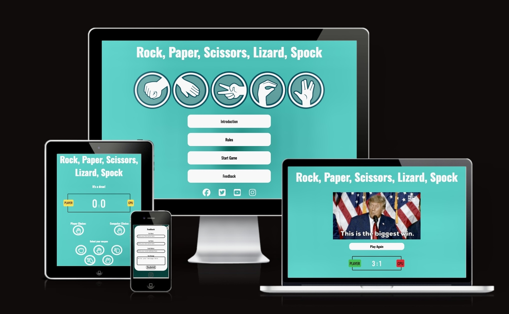

## User Experience (UX)
### Project Goals 
<li> Create a fun engaging game using HTML5, CSS3 and JavaScript.

### User Goals
<li> The user must be able to navigate the website clearly.
<li> The user must be able to understand the game instructions.
<li> The user should enjoy the game.
<li> The user should want to return to the game for a challenge.
<li> The user should spread the word to his/her friends for them to come and check it out.

## Features
### Main Page
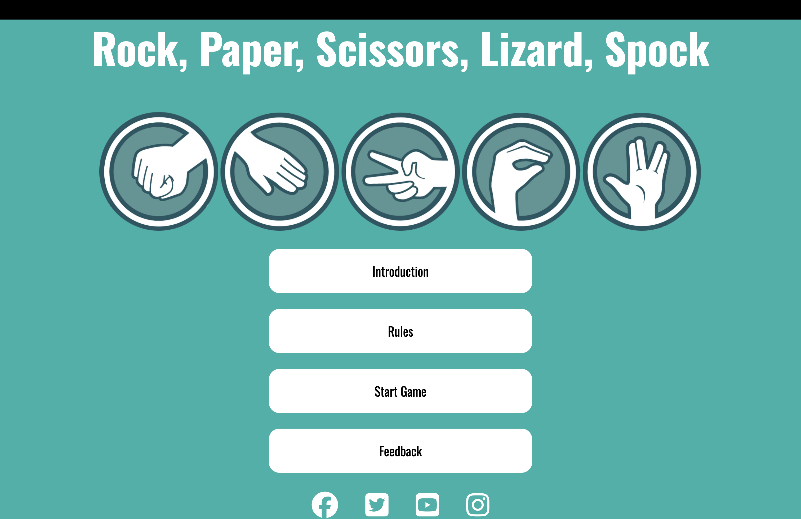
<li> The main page is the first thing the user will see, this has the heading, the logo and navigation buttons to learn everything you need to know about the game.

### Introducton
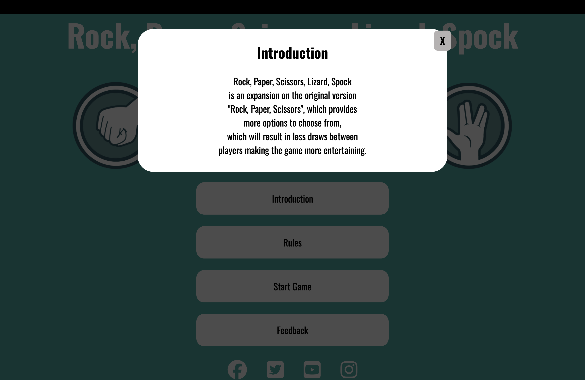
<li> The introduction expplains the game is an expansion on the original version "Rock, Paper, Scissors".

### Rules
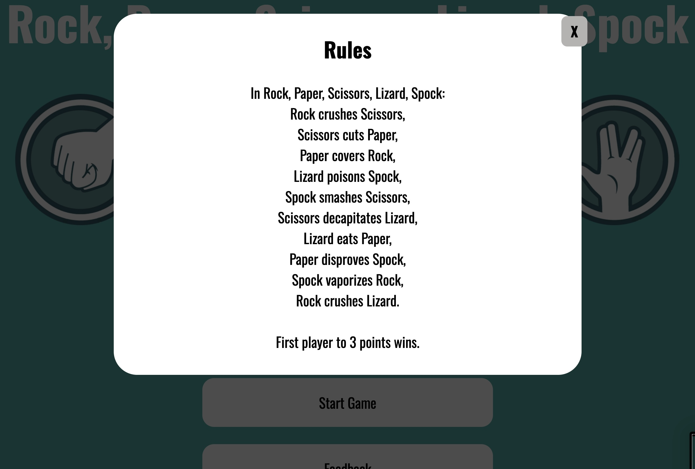
<li> This pop-up explains the rules of the game of which weapon defeats the other.
<li> The rules section also adds that the winner is determined by the first player to 3 points.

### Winning result
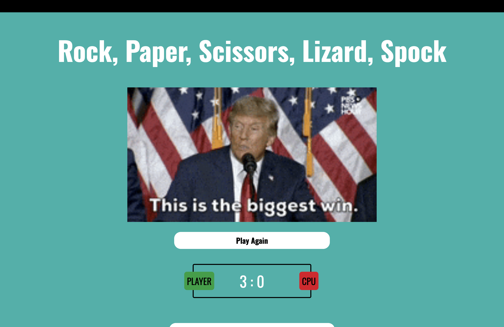
<li> A gif will pop up when the user wins the game.

### Losing result
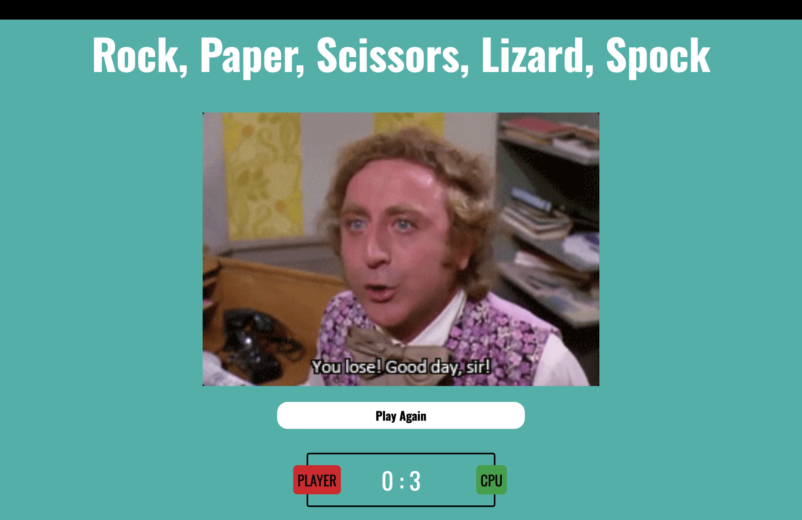
<li> A gif will pop up when the user loses the game.

### Feedback
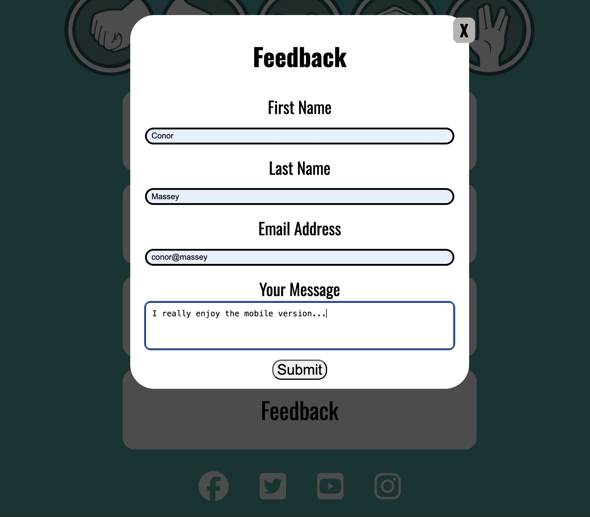
<li> There is a section for any user to give some feedback or ask questions.

### Social Media Footer Links

<li> At the bottom of the main page there are 4 social media external links.

## Technologies Used
 [HTML5](https://en.wikipedia.org/wiki/HTML)
 <li> This project uses HyperText Markup Language.
 

 [CSS3](https://en.wikipedia.org/wiki/CSS)
 <li> This project uses Cascading Style Sheets.

 [JavaScript](https://en.wikipedia.org/wiki/JavaScript)
 <li> This project uses JavaScript.
 

 [Chrome](https://www.google.com/intl/en_uk/chrome/)
 <li> This project uses Chrome to DevTools to test and check for errors.
 

 [Google Fonts](https://fonts.google.com/)
 <li> This project used Google Fonts to import fonts.

 [GitHub](https://github.com/)
 <li> This project used GitHub to store the the file on the dashboard.

 [GitPod](https://www.gitpod.io/)
 <li> This project was created using GitPod.

 ## Testing/Validation
 ### Google DevTools
 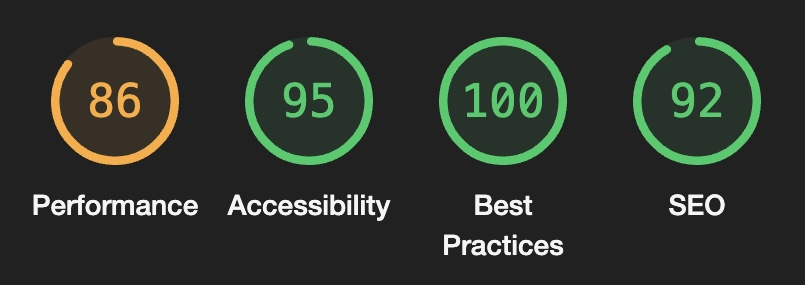

 ### [W3C HTML Validator](https://validator.w3.org/nu/#textarea)
 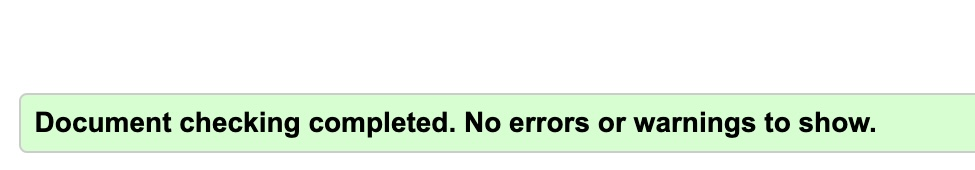
 <li> No errors to be found.

 ### [W3C CSS Validator](https://jigsaw.w3.org/css-validator/validator)
 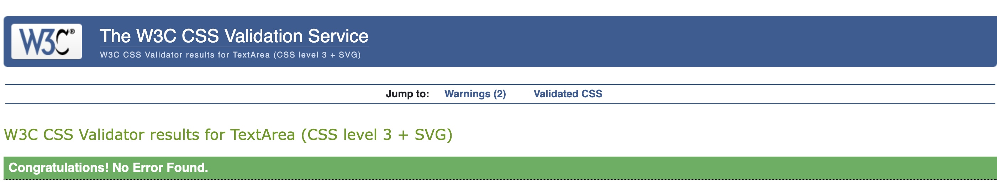
 <li> No errors to be found.

 ### [JS Hint](https://jshint.com/)
 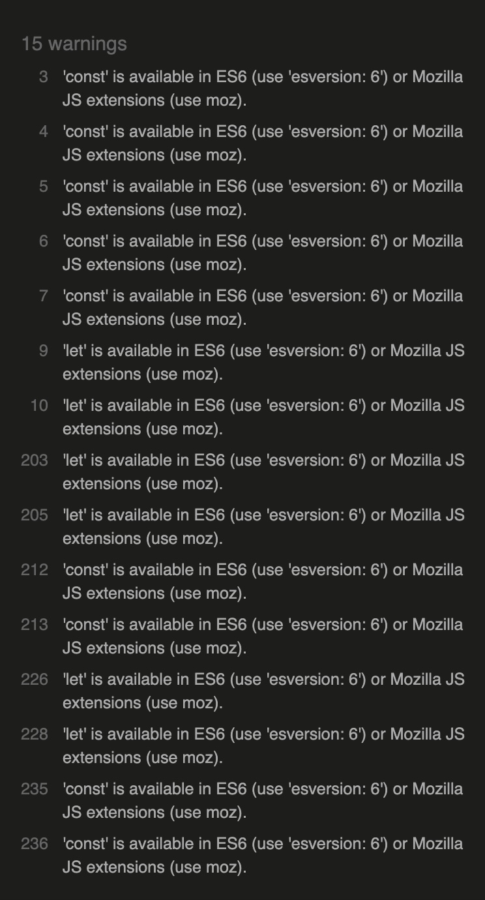

 ### Returned Errors
 <li> Logo image names had spaces in them.
 <li> Line breaks had a trailing forward slash.

 ## Deployment 
